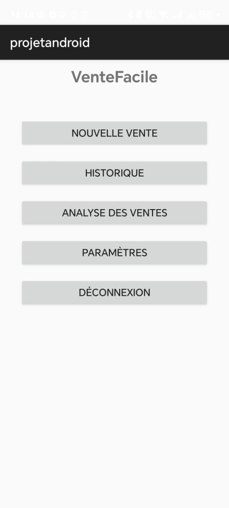

<a id="readme-top"></a>

<!-- PROJECT LOGO -->
<br />
<div align="center">
  <h3 align="center">SalesTracker</h3>
  <p align="center">
    An Android mobile application for sales management and point-of-sale operations with real-time tracking and analytics.
  </p>
</div>

<!-- TABLE OF CONTENTS -->
<details>
  <summary>Table of Contents</summary>
  <ol>
    <li>
      <a href="#about-the-project">About The Project</a>
      <ul>
        <li><a href="#built-with">Built With</a></li>
      </ul>
    </li>
    <li><a href="#architecture">Architecture</a></li>
    <li><a href="#screenshots">Screenshots</a></li>
    <li>
      <a href="#getting-started">Getting Started</a>
      <ul>
        <li><a href="#prerequisites">Prerequisites</a></li>
        <li><a href="#installation">Installation</a></li>
      </ul>
    </li>
    <li><a href="#contact">Contact</a></li>
  </ol>
</details>

<!-- ABOUT THE PROJECT -->

## About The Project

<a href="https://github.com/YourUsername/SalesTracker-Android">
    
</a>

SalesTracker is a comprehensive Android mobile application designed for sales management and point-of-sale operations. Built with Java and modern Android development practices, this app provides a complete solution for tracking sales, managing inventory, and analyzing business performance on the go. Key features include:

- **Sales Management**: Create and process new sales transactions with ease.
- **Product Management**: Add, edit, and organize your product inventory with detailed information.
- **Sales History**: View and search through complete sales records with detailed transaction information.
- **Analytics Dashboard**: Visualize sales performance with charts and statistics.
- **Location Tracking**: Map-based sales tracking with geolocation integration using OSMDroid.
- **User Authentication**: Secure login and registration system powered by Firebase Authentication.
- **Real-time Sync**: Firebase Realtime Database integration for data synchronization across devices.

### Built With

This project is built with the following technologies:

- [![Java][Java.com]][Java-url]
- [![Android][Android.com]][Android-url]
- [![Firebase][Firebase.com]][Firebase-url]
- [![Gradle][Gradle.com]][Gradle-url]
- [![Material Design][Material.com]][Material-url]
- [![OSMDroid][OSM.com]][OSM-url]

<!-- Reference-style links for images -->

[Java.com]: https://img.shields.io/badge/Java-007396?style=for-the-badge&logo=openjdk&logoColor=white
[Java-url]: https://www.java.com/
[Android.com]: https://img.shields.io/badge/Android-3DDC84?style=for-the-badge&logo=android&logoColor=white
[Android-url]: https://developer.android.com/
[Firebase.com]: https://img.shields.io/badge/Firebase-FFCA28?style=for-the-badge&logo=firebase&logoColor=black
[Firebase-url]: https://firebase.google.com/
[Gradle.com]: https://img.shields.io/badge/Gradle-02303A?style=for-the-badge&logo=gradle&logoColor=white
[Gradle-url]: https://gradle.org/
[Material.com]: https://img.shields.io/badge/Material%20Design-757575?style=for-the-badge&logo=material-design&logoColor=white
[Material-url]: https://material.io/
[OSM.com]: https://img.shields.io/badge/OSMDroid-7EBC6F?style=for-the-badge&logo=openstreetmap&logoColor=white
[OSM-url]: https://github.com/osmdroid/osmdroid

<p align="right">(<a href="#readme-top">back to top</a>)</p>

<!-- ARCHITECTURE -->

## Architecture

The application follows modern Android architecture patterns with clear separation of concerns:

- **View Layer** — Activities for user interface (Login, Register, Main Dashboard, Product Management, Sales Analytics, History, etc.)
- **Model Layer** — Data models representing products, sales, users, and transactions
- **Adapter Layer** — RecyclerView adapters for displaying lists of products and sales
- **Util Layer** — Helper classes and utilities for common operations
- **Firebase Integration** — Backend services for authentication (Firebase Auth) and real-time data storage (Firebase Realtime Database)
- **Location Services** — Google Play Services for location tracking and OSMDroid for map visualization

The app uses ViewBinding and DataBinding for efficient view management, with Gradle as the build system and Firebase for backend services.

<p align="right">(<a href="#readme-top">back to top</a>)</p>

<!-- SCREENSHOTS -->

## Screenshots

Here are some screenshots of the project:

| Clients                     | Sales Management    | Map Location                |
| --------------------------- | ------------------- | --------------------------- |
| ![dashboard][dashboard-img] | ![sales][sales-img] | ![analytics][analytics-img] |

[dashboard-img]: screens/clients.jpeg
[sales-img]: screens/transaction.jpeg
[analytics-img]: screens/map.jpeg

<p align="right">(<a href="#readme-top">back to top</a>)</p>

<!-- GETTING STARTED -->

## Getting Started

To run the project locally, follow these steps for a minimal development setup.

### Prerequisites

- Android Studio (latest version recommended)
- Java JDK 11+
- Android SDK (API level 24 or higher)
- Firebase account (for authentication and database)
- Google Play Services (for location features)

### Installation

1. Clone the repository

```sh
git clone https://github.com/YourUsername/SalesTracker-Android.git
```

2. Open the project in Android Studio

   - File → Open → Select the project directory

3. Configure Firebase

   - Create a new Firebase project at [Firebase Console](https://console.firebase.google.com/)
   - Add an Android app to your Firebase project
   - Download the `google-services.json` file
   - Place it in the `app/` directory
   - Enable Firebase Authentication and Realtime Database in your Firebase console

4. Update local configuration

   - Create or update `local.properties` with your SDK path
   - Sync Gradle files

5. Build and run
   - Connect an Android device or start an emulator
   - Click the "Run" button in Android Studio or use:

```sh
./gradlew assembleDebug
./gradlew installDebug
```

The app requires minimum Android 7.0 (API 24) and is optimized for Android 14 (API 35).

<a id="contact"></a>

## Contact

Hamza Alali - [hamza.alali.dev@gmail.com](mailto:hamza.alali.dev@gmail.com)

Connect with me:

- <a href="https://dev.to/@hamzaalali0" target="_blank"></a>
- <a href="https://www.linkedin.com/in/hamza--alali" target="_blank"></a>
- <a href="https://github.com/hamza-alali-0" target="_blank"></a>
- <a href="https://www.instagram.com/alalihamza.0/" target="_blank"></a>

Project Link: [https://github.com/YourUsername/SalesTracker-Android.git](https://github.com/YourUsername/SalesTracker-Android.git)

<p align="right">(<a href="#readme-top">back to top</a>)</p>
